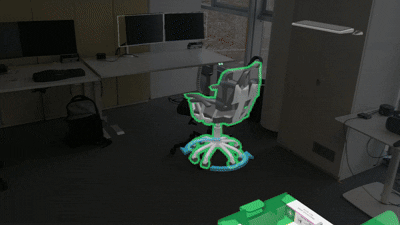

# Short Portfolio
This is a brief collection of insights to my private and some of my professional projects.

## Introduction
Hi, I am Lukas, a passionate programmer, proud engineer and 3D designer specialized on Extended-Reality content. Sometimes I spend my free time crafting games or rendering digital drawings and models. Have fun scrolling!

## Work Projects

### A Tooling Editor for Creating XR-Training Content
As an individual contributor, I developed a tooling editor for creating interactive extended reality content for users without coding experience. The solution enables users to create customized training environments for employee qualification. I added some sample scripts to this repository, demonstrating my use of advanced programming techniques such as [reflection](https://learn.microsoft.com/en-us/dotnet/csharp/advanced-topics/reflection-and-attributes/), the implementation of graphical property editors through abstraction and interfacing, or the usage of patterns like [MVVM](https://learn.microsoft.com/de-de/dotnet/architecture/maui/mvvm).

  

Authored content can then be used by trainees to train procedures in VR or get on demand AR assistance. The same .NET, Unity and Microsoft Mixed Reality Toolkit codebase and configured dataset is used for adaptable VR and AR render mode, depending on the platform or trainee input.

    
  

This project is work-related, but I am using parts of my property editing techniques in private projects as well.
Most recently, I have been driving the integration of interactive 3D GenAI assistants that users in Virtual Reality interact with through natural speech. A publically available promo-video where a training based on content authored using this tool is performed can be found [here](https://www.youtube.com/watch?v=3YSKxpiUAAs).

### A Human-In-The-Loop Training Gym for Industrial Robots
This project is the practical outcome of my masters-thesis, I used it to prove that demonstrations for grasping loose objects from a bin can impact the robot's machine learning process positively. Here is a [link](https://www.researchgate.net/publication/364514757_Augmented_Virtuality_Input_Demonstration_Refinement_Improving_Hybrid_Manipulation_Learning_for_Bin_Picking) to my publication based on this work. I presented it at the FAIM 2022 conference in Detroit, Michigan, US.

Download [this](Resources/FAIM_HybridLearning_DemoVideo.mp4) video to get some more insight!

## Private Projects

### Total Recall Worlds SneakPeak
My most recent game project is called “Totall Recall Worlds.” It is loosely inspired by the successful The Sims series, published by EA in the early 2000s. My girlfriend enjoys playing The Sims but has not found similar titles released in recent years particularly appealing. So, I decided to give it a try, and together we defined the following concept:

* A new planet—potentially Mars, although I have not decided yet—is being settled by different species from across the galaxy.
* The inhabitants interact, form friendships, fall in love, and start families.
* Characters have wants and needs that the player must fulfill. Some of these can be quite demanding.
* Players can engage in economic simulations inspired by games such as Factorio to increase their income or even establish new businesses.
* Characters and the interiors of their houses can be customized using a tooling editor.
* Houses, or so-called “community places,” can be visited in VR with real-world friends through multiplayer. Players can showcase their interior designs or play mini-games, such as bowling, at these locations.

I am having fun and will see where it goes.

  
  

### More Animations & Drawings
Here are some other projects I made for friends. The left one is a promo-video for a CNC machine, the right one is a drawing I made as a birthday present a few years ago - here's a photo of the rendered drawing:

  
  

By the way, you can navigate to the Resource folder of this repo to have a look at all media in larger resolution :) Clicking on them here also works!

### Web-Game - Love is Phina:
My vibe-coding web project. I wrote this game in two days using an AI assistant and node.js. The result is a clean project seperated into JavaScript, HTML and CSS for web- and mobile platforms. The principle in short: In a matching round, session participants answer questions stated by the server, then matches are made based on the answers. The matched "couples" then answer more questions focusing on a potential relationship rather than on personal preferences, their scores are live tracked in a table on the host view. The couple with the highest score wins and is allowed to make their engagement.

  
  
  

The project can be used securely from anywhere as I added https tunneling, scaling is tested for up to 50 session participants which I verified using agentic bots. 

  
  

I am considering to transfer the idea into a gamified dating app, but similar concepts do exist and I am still trying to define a USP.

### Computational science projects
During my mechanical engineering studies, I really enjoyed focusing on 3D problem analysis of manifolds and computational dynamics from a theoretical point of view. One of my reports can be found [here](Resources/GNI_Report_GL_Zikeli.pdf).

  

For uncompressed files, detailed insights or questions regarding the code, please contact me directly via [lukas@luphi.net](mailto:lukas@luphi.net?subject=About%20your%20portfolio).
