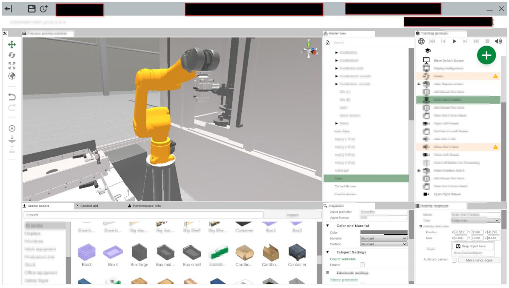
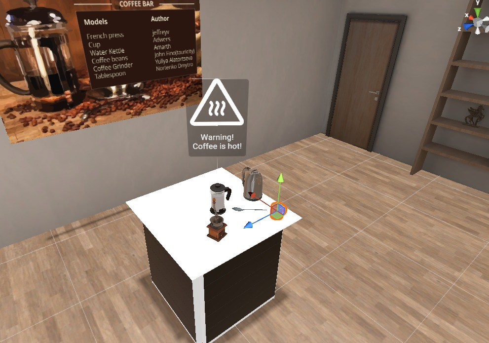
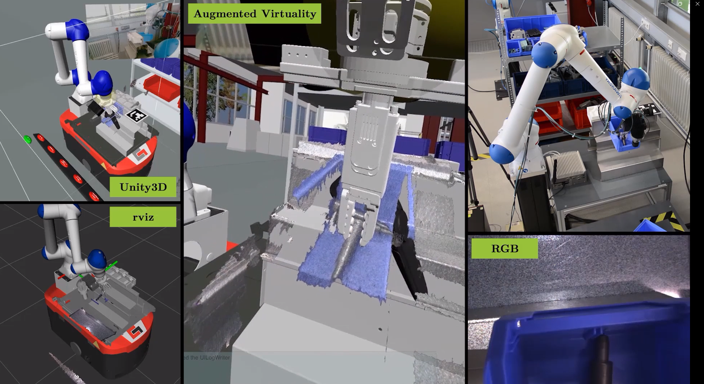
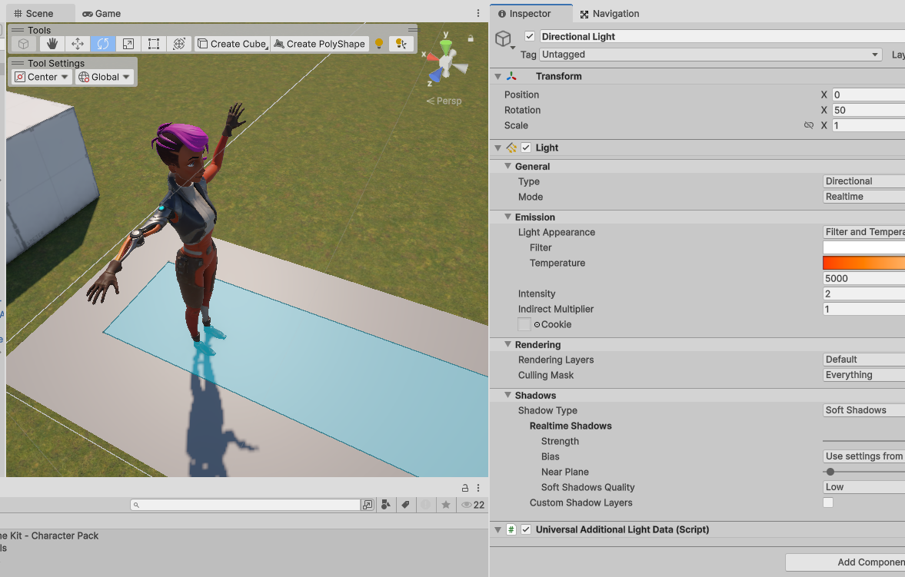
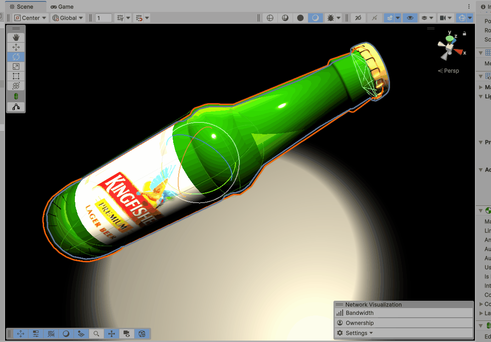
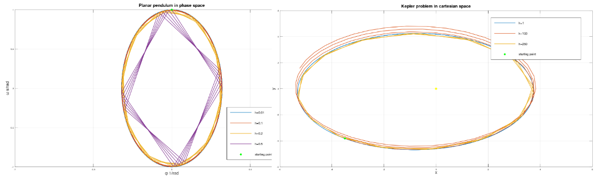
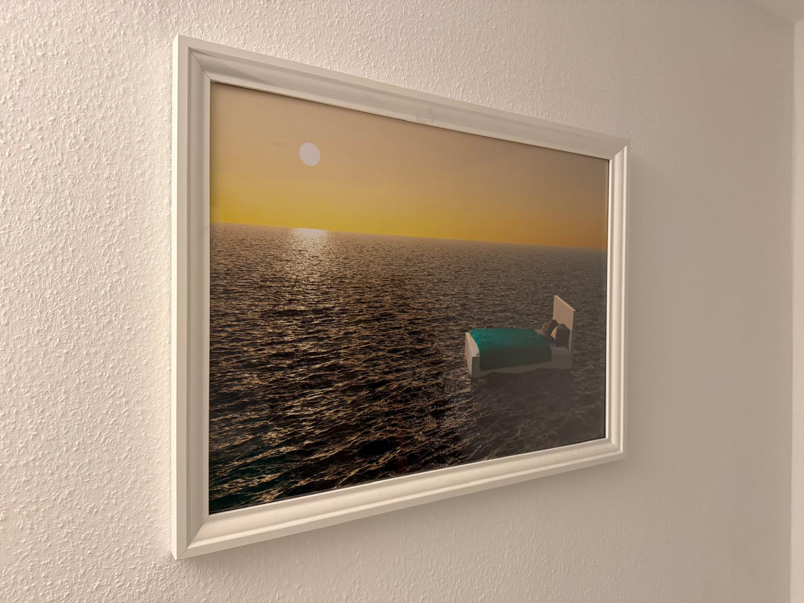

# Short Portfolio
This is a brief collection of insights to my private and some of my professional projects.

## Introduction
Hi, I am Lukas, a passionate programmer, proud engineer and 3D designer specialized on Extended-Reality content. Sometimes, even though I am not really a regular gamer, I spend my free creating computer games, composing music or rendering digital drawings or models. Have fun scrolling!

## Work Projects

### A Tooling Editor for Creating XR-Training Content
In this project, I wrote a tooling editor for creating interactive Extended-Reality content for people without coding skills as an individual contributor. The solution allows to create your own training environment for employees to be qualified. I added some sample scripts to this repository, demonstrating my use of advanced programming techniques such as [reflection](https://learn.microsoft.com/en-us/dotnet/csharp/advanced-topics/reflection-and-attributes/), the implementation of graphical property editors through abstraction and interfacing, or the application of patterns like [MVVM](https://learn.microsoft.com/de-de/dotnet/architecture/maui/mvvm).

  
  

This project is work-related, but I am using parts of my property editing techniques in private projects as well.
Most recently, I have been driving the integration of interactive 3D GenAI assistants that users in Virtual Reality interact with through natural speech.

### A Human-In-The-Loop Training Gym for Industrial Robots
This project is the practical outcome of my masters-thesis, I used it to prove that demonstrations for grasping loose objects from a bin can impact the robot's machine learning process positively. You can find links to my successfull publication based on this research in my CV.

Download [this](Resources/FAIM_HybridLearning_DemoVideo.mp4) video to get some more insight!

## Private Projects

### Total Recall Worlds SneakPeak
My most recent game project is called "Totall Recall Worlds" and is loosely based on the successfull "Sims" series published in the early 2000s by EA. My girlfriend likes to play the former a lot but didn't like similar titles having been published in the last years. So I decided to give it a shot and we defined the following conept:

* A new planet, potentially Mars (I haven't decided on that yet) is being settled from different beings around the galaxy.
* They interact, craft friendships and fall in love, founding new families.
* Characters have wants and needs which the player has to fullfill, sometimes they can be quite demanding
* Players can play economy simulations in the style of games like factorio to increase their income, or even found new businesses
* Of course, characters and house's interiors can be edited using a tooling editor.
* Houses or so called "Community Places" can be entered with real-world friends in VR via Multiplayer, to display interior decoration or to play mini games like bowling at the latter

I am having fun and will see where it goes.

  
  

### Computational science projects
During my mechanical engineering studies, I really enjoyed focusing on 3D problem analysis of manifolds and computational dynamics from a theoretical point of view. One of my reports can be found [here](Resources/GNI_Report_GL_Zikeli.pdf).

  

### More Animations & Drawings
Here are some other projects I made for friends. The left one is a promo-video for a CNC machine, the right one is a drawing I made as a Birthday present a few years ago - here's a photo of the rendered drawing:

  
  

Under Resources in this repo, you will displayed sources, some more professional projects in the domain of theoretical robotics dynamics and the promised sample scripts.

### Web-Game - Love is Phina:
My vibe-coding web project. I wrote this game in two days using an AI assistant and node.js. The result is a clean project seperated into JavaScript, HTML and CSS for web- and mobile platforms, developments are currently still ongoing. The principle in short: In a matching round, session participants answer questions stated by the host, then matches are made based on the answers. The matched "couples" then answer more questions focusing on a potential relationship rather than on personal preferences, their scores are live tracked in a table on the host view. The couple with the highest score wins and is allowed to make their engagement.

  
  
  

For uncompressed files, detailed insights or questions regarding the code, please contact me directly via [lukas@luphi.net](mailto:lukas@luphi.net?subject=About%20your%20portfolio).
